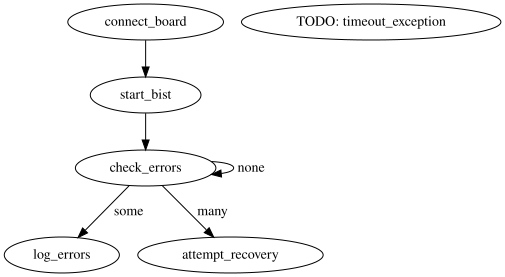

# Beam Test

Folder for everything related to the upcoming radiation test in December 2022.

## Hardware Images

The following hardware images need to be created for the radiation test.

### Baseline Unmittigated VexRiscv Bare Metal system ("Bare")

A baseline VexRiscv Litex SoC system will be created that will form the core of all of the hardware systems we create for this test.
The building of the system must be very clearly documented and all custom scripts, hardware modules, and software must be committed to a public repository. 
Timestamps and commit tags of the software used to build the processor must be clearly documented.
The requirements of this base SoC system are as follows:

* Default VexRiscV system from Litex for the NexysVideo board
* Supports SD card configuration and booting
* UART for logging output
* DDR Controller as a peripheral (need to disable the cache: caching not needed here)
  * Ability to Read/restore internal DDR mode registers (with corresponding BIOS)
  * Ability to read/restore delay registers (with corresponding BIOS)
  * No ECC module on the DDR interface
* Updated BIST module for custom BIST modes (with corresponding BIOS)
* BSCAN module for querying status/providing remote control
  * Read status of MMCM locked signal (to determine MMCM failure). Use three bits for status (for future TMR)
  * Provide a remote reset so we can try to restart without power cycling. Use three bits for reset (for future TMR)

### Baseline Mitigated VexRiscv Bare Metal system ("TMR")

The tools and IP used for the mitigation should be carefully documented so the design can be reproduced.
Any steps involved with checking and setting timing need to be described carefully.
The following additions to the baseline system will be added for mitigation.

* Apply TMR to the system
* Create a Triplicated clocking/MMCM module so we can have triplicated clocks
* BRAM scrubbing
* Provide reading/scrubbing of the I/O delay elements
* Use three separate bits and voting for BSCAN status and control
* See if we can manually change the routing so that the single-point failure lines are as short as possible (i.e., the signals branch soon after the single-point location). Mostly for the DDR signals.
* Figure out how to triplicate global GND and Power signals
* Is it possible to register the DDR signals right at the pads so we can move the FFs close to the pads?
 
### Unmittigated system with ECC ("ECC")

The Baseline unmitigated system is modified to include the ECC module between the BIST system.
This is used to validate the operation of the ECC (when the DDR is placed in the beam).
ECC is not used in the regular system because it messes up the addresses and makes it difficult to know what really happened.

## Radiation Experiments

### FPGA Experiment (Mitigated and Unmitigated)

The purpose of this experiment is to obtain cross section data on the SoC system as well as the DDR interface.
We will also be using this unmitigated version to debug the response/recovery scripts with this system (since the errors will come more frequently and we can get ready for the overnight mitigated tests).
The FPGA is placed in the beam with scrubbing to cause upsets in the SoC system (and not the DDR).
In this experiment, the FPGA is placed in the beam and the DRAM is shielded as best we can.
We expect few DRAM errors (although they may occur occasionally from secondaries).
We expect most errors (if not all) to occur from the FPGA processor and memory controller.

The purpose of this test is as follows:
  * Measure the cross section of the overall processor system (with TMR and without TMR)
    * Measure the processor cross section independent of the controller (we assume the memory controller has a larger cross section)
    * Check for processor hangs, UART issues, or incorrect execution
  * Measure the cross section of the DDR controller (independent of the processor)
    * Since the DDR controller is not used by the processor for execution, we can test it independently of the processor
    * Check for memory errors, controller errors (all bad data)
    * Identify any specific processor failure modes (and measure their cross section)
  * Identify and validate processor recovery methods
    * Issue internal reset (as a step before repower). This might identify unrepairable BRAM ROM corruption
  * Identify and validate DDR controller recovery mechanisms

Test Procedure
- Power up and Configure the FPGA (SD-CARD config and boot so no additional step is needed)
  * Pexpect to check and see if it is booted properly (before issuing more commands)
- Start BIST check
  * Full write/read of memory in fixed sized chunks
- Small DRAM errors
  * Just record DRAM errors. No need to scrub (they will be fixed on next BIST cycle)
  * We expect few DRAM errors (only those "in flight" within the FPGA)
- Large DRAM error count (some sort of a SEFI)
  * Try BIST again to see if a new BIST cycle will flush this out
  * If this fails, read/scrub the DDR mode registers (try BIST again after this)
  * If this fails, read/scrub the DDR delay registers (i.e., scrub delays) to fix calibration issues
  * If this fails, issue a DDR "calibrate" command
  * If this fails, issue a DDR "initialize" command
  * If this fails, repower (even though processor works)
* If the processor hangs and doesn't respond (PEXPECT)
  * Try a remote reset via BSCAN
  * If this does not recover, issue a repower

### DDR FPGA Experiment

In this experiment, the DDR is placed in the beam and the FPGA controller is shielded as best we can.
We expect few FPGA/controller issues (we will be scrubbing the FPGA just in case).
We can use either the unmitigated or mitigated controller.
Ideally, we can just use the unmitigated version.
We expect most errors (if not all) to occur from the DDR.
The purpose of this test is as follows:
  * Measure the per bit cross section of the DDR memory cells
  * Identify possible MCUs in the per bit cross sections
  * Measure the SEFI cross section of the DDR
    * Identify different SEFI modes (primitive reason for DDR failure)
  * Identify low-cost error recovery mechanisms when SEFI occurs

Test Procedure
* Power up and Configure the FPGA (SD-CARD config and boot so no additional step is needed
  * Pexpect to check and see if it is booted properly (before issuing more commands)
* Intialize the memory with BIST (including ECC words)
  * Use an "incrementing" or "fixed value" pattern so we know what should be in each word
  * Read all the internal DRAM registers/state as a golden copy
* Continuously read the memory through BIST in some block size (1k?)
  * If a memory error has occured in a block:
    * Read the raw data from software from the entire block to find the word(s) that failed (and log it). Do a bitwise compare and print out the address and bits that failed
    * BIST write to the block to repair the memory
    * Continue the BIST reading where we left off
  * If the bist error count is above some threshold, go through some sort of memory congtroller diagnosis and attempt recover
    * try Bist read again to see if this was a temporary issue or bigger issue (move on if the second read is ok)
    * Read mode registers (repair if there was a problem)
    * Do a reinitialization/recalibration of DRAM if updating mode instructions doesn't solve the problem
  * Recalibrate
* If the processor hangs and doesn't respond (PEXPECT)
  * Try a remote reset (PMOD I/O? BSCAN?)
  * Repower

### DDR ECC Experiment

* Use ECC with BIST 
  * **Goal**: Demonstrate that the ECC core actually works in the beam. Proof of concept.
  * Initialize memory with BIST write. Do continuous reads.
  * No need to run very long. Accumulate about 100 errors if possible (simple cross section)
  * Script
    * Wait for system to boot
    * sdram_bist_pat 0x55
    * sdram_bist 0x1000 1 0 1
    * Expect proper output. Look for hanging or vary large number of errors (three error columns). Scrub with failures?
* Create system without ECC in BIST (raw mode)
  * The ECC just gets in the way if we can do raw reads to find all errors (not just SEC and DED errors)
  * Variant 1: "Static" test
    * Write the memory at the start, then do reads very infrequently (collect DRAM errors)
      * sdram_bist_pat 0x55
      * sdram_bist_gen 0x0 0x8000000 0
      * <Wait ~10 seconds to collect errors>
      * sdram_bist_chk 0x0 0x8000000 0
      * Scrub the mode registers
      * <Go back to the wait command>
    * Goal: get raw static cross section without dynamic activity
  * Variant 2: "Dynamic" Read Test
    * Write the memory at the start, then do reads continuosly (get the dynamic impact of reading)
      * sdram_bist_pat 0x55
      * sdram_bist 0x1000 1 0 1
  * Variant 3: "Dynamic" Read/Write Test
    * Continuously write/read to increase the dynamic cross section
      * sdram_bist_pat 0x55
      * sdram_bist 0x1000 1 0 0
  

Expected DDR Errors:
* DRAM memory cell errors (will show up as single-bit errors and possibly double-bit errors)
  * BIST engine will report single and double and DRAM error
* Internal DRAM bank machine failures
  * Very large number of errors from the BIST
  

## To Do

- [ ] Log errors with timestamps.
- [ ] Detect and handle failure types.
  - [ ] Controller failures.
  - [ ] Processor failures.
<!-- - [ ]  -->

 
## Test

 
# Post Radiation Testing Notes
 
In our beam testing of the VexRisc Linux system we identified 28 failures of the TMR system. Of these, 13 were reproducable 100% of the time with fault injection. We need to try to identify what was going on in the other 15. The text below proposes a variety of reasons why these faults are not reproducable with fault injection.
 
 1. Single point failures that you cannot inject faults in.
 
 SERDES delay lines, Flip-flops, BRAM contents, DRP port bits (MMCM, MGT, etc.).
 
 SEFIs are a special case of this.
 
 2. TMR portions that cannot be scrubbed or fault injected
 
 Case 1: Similar to the first category but cannot be scrubbed (or inject faults into). This is accumulation of bits. Takes longer to get to this point.
 
 Case 2: no feedback voting/repair. ROMs, BRAMs that dont write very often, internal feedback that does not have feedback voting
 
 3. Difficult to reproduce with fault injection
 
 Low probability faults. Faults that cause history and do not manifest themselves some time later.
 
 
 
 
 
